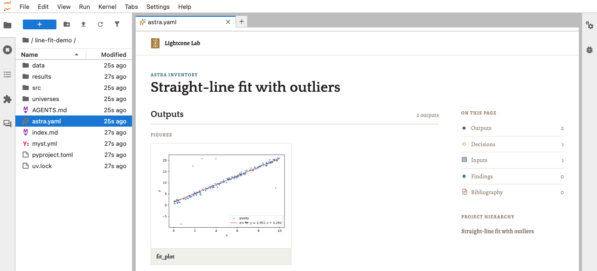

# Quickstart

Before you start, you'll need [uv](https://docs.astral.sh/uv/) 0.12 or
newer. If you don't have it, follow its
[installation guide](https://docs.astral.sh/uv/getting-started/installation/);
if you do, run `uv self update`.

Lightcone has two parts to set up: the plugin, which drives your
analysis through your agent, and JupyterLab, where you watch it take
shape.

## 1. Install the Lightcone plugin

The plugin is what drives Lightcone. Choose your agent:

<div class="soon-1" markdown>

=== "Claude Code"

    ```bash
    claude plugin marketplace add LightconeResearch/agent-skills
    claude plugin install lightcone@lightcone-research
    ```

=== "Codex"

    ```bash
    codex plugin marketplace add LightconeResearch/agent-skills
    codex plugin add lightcone@lightcone-research
    ```

    The first time Codex asks you to review the plugin's hooks, approve
    them: they are how the plugin checks the agent's work.

=== "OpenCode (soon)"

    Coming soon.

</div>

## 2. Install JupyterLab with Lightcone Lab

Lightcone Lab is a JupyterLab extension that shows a project's results
and their status, its decisions, and the papers it cites.

<div class="soon-2" markdown>

=== "JupyterLab"

    Install JupyterLab with Lightcone Lab, and `lc`, the Lightcone command
    line the plugin drives:

    ```bash
    uv tool install jupyterlab --with jupyterlab-lightcone --with-executables-from jupyter-core,lightcone-cli
    ```

    Then start it:

    ```bash
    jupyter lab
    ```

    Already installed `lc` on its own? Leave `lightcone-cli` out of
    `--with-executables-from`, or uv refuses to replace it.

=== "VS Code (soon)"

    Coming soon.

=== "Localhost (soon)"

    Coming soon.

</div>

## 3. Start a new project

*Under maintenance.*

<!-- Docs TODO: project creation is being reworked.
     Write this step once it lands, and link the guide that explains each
     part of a project. -->

## 4. Watch it in Lightcone Lab

In JupyterLab's file browser, open your project's directory. The status
bar shows **Lightcone · _your project_**; click it to open the project: its results,
their status and provenance, and its decisions. Lab checks for changes
every 15 seconds, so it keeps up as your agent works.



## 5. Keep working as usual

Use your agent however you normally would to work through the project,
in JupyterLab's terminal or any other. Whenever you start it in the
project's directory, it manages everything through Lightcone: decisions
go into the analysis file, results are made with `lc`, and it keeps
track of what's out of date.

## 6. Commands to know

```bash
CLUSTER=$(lc compute launch --wait)   # start compute on this machine, keep its name
lc materialize "$CLUSTER"             # make the results, each recorded with what made it
lc status                             # see which results are out of date, and why
```

The local cluster stops on its own after 30 minutes without work. Run
these yourself, or ask your agent to. The
[`lc` reference](../reference/cli/index.md) covers every command.

## Next steps

- [Work through a full analysis](../tutorial/index.md) in the Tutorial,
  from question to published result.
- [See how Lightcone works](how-it-works.md): the project, the run, and
  the record behind every result.
- [Get more out of Lightcone Lab](../guides/lab.md), including its
  built-in agent chat, run [on a compute cluster](../guides/cluster.md),
  or [write up your analysis with MyST](../guides/publish.md).
- Working without an agent, or without JupyterLab? See
  [Use lc without an agent](../guides/without-agent.md) and
  [Installation](../reference/installation.md).

## Uninstall

=== "Claude Code"

    ```bash
    claude plugin uninstall lightcone@lightcone-research
    claude plugin marketplace remove lightcone-research
    uv tool uninstall jupyterlab
    ```

=== "Codex"

    ```bash
    codex plugin remove lightcone@lightcone-research
    codex plugin marketplace remove lightcone-research
    uv tool uninstall jupyterlab
    ```

Uninstalling `jupyterlab` also removes Lightcone Lab and `lc`. If you
installed `lc` on its own, remove it with `uv tool uninstall lightcone-cli`.
Your projects are left as they are: everything Lightcone knows about an
analysis lives in the project's own git repository.
