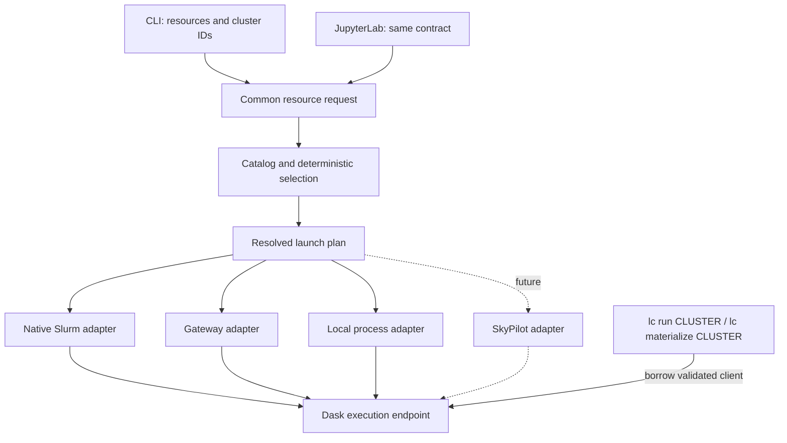

# Compute clusters: resource requests and native allocation

Proposal for review, 2026-09-27. Reference deployment: NERSC. Repository reviewed
at `3aa823b46ec016a1b7a52515f4c0ee6eb35d3b8d`.

This is the current architecture proposal, developing the
[initial design](lightcone-serverless-compute-spec.md). Commands and configuration
below describe the full design. The first implemented slice supplies the common
resource API, local and native Slurm providers, and explicit-cluster execution
for `run` and `materialize`. Gateway and browser integration remain unimplemented.
Execution uses ordinary Dask submission without a separate worker-selection or
per-worker validation framework, following the PR review's simplicity decision.
The reusable-execution cancellation/fencing work is deferred by user decision;
the [current deployment guide](docs/user/cluster.md) states the implemented limits.
Research used official documentation and upstream source; no live NERSC or Gateway
deployment was exercised.

## Executive summary

**The agent asks for resources and receives a cluster. The user configures where
those resources can come from.** Lightcone uses native Slurm, Dask Gateway, or
local processes to create and manage that cluster. We borrow the small resource
vocabulary of SkyPilot; we do not integrate SkyPilot now.

**Execution always names a cluster.** `lc run` and `lc materialize` take its ID
as their first argument. This applies equally to local, Slurm, and Gateway
compute. Only `lc compute launch` creates a cluster; execution commands never
create one implicitly or infer one from the current environment.

A practical workflow looks like this:

1. **See what can be requested.** `lc compute resources` shows the configured
   resource shapes, maximum cluster sizes, time limits, and startup classes.
   For example, the user can expose a small, fast-access offer
   and a larger batch offer. These are permissions and capabilities to request
   compute, not a promise that machines are immediately free.
2. **Request a cluster.** For example:

   ```bash
   lc compute launch --num-nodes 2 --cpus '32+' --memory '128+' --time 1h
   # Returns an opaque cluster ID, illustrated below as clu_…
   ```

   This asks for two execution nodes, each with at least 32 logical CPUs and
   128 GiB of memory. `+` permits a larger offered shape. Lightcone chooses the
   first eligible offer in the user's configured order and reports the actual
   plan, including any extra capacity. `--startup fast` would
   restrict selection to offers configured for fast access. No provider name,
   account, partition, or queue appears in the agent's command.
3. **On NERSC, Lightcone executes Slurm commands directly.** A batch offer becomes
   one `sbatch` job. An interactive offer becomes an `salloc` allocation. In both
   cases, one `srun` step launches standard Dask components: the first node runs
   a scheduler and a worker, and the others run workers. A thin launcher supplies
   settings, private connection material, and allocation identity. Dask supplies
   the scheduler and worker lifecycle; Slurm owns and terminates the allocation.
   There is no custom Dask worker or per-node process supervisor.
4. **Wait, then reuse the cluster.** Substitute the returned ID for `clu_…`:

   ```bash
   lc compute status                         # List active allocations
   lc compute status clu_… --wait --timeout 1800
   lc materialize clu_…
   lc run clu_… -- python scripts/check.py
   ```

   Materialization distributes recipes; `lc run` runs one sandboxed command on
   one worker. The invoking process still prepares the project and records
   results. Each execution leaves the cluster available for another command.
   Omitting the cluster is an error before execution or environment preparation.
5. **Release it.** `lc compute down clu_…` terminates the allocation, including
   one still waiting in a queue. The configured or requested time limit also
   ends supported allocations. Resources remain allocated while idle.

When selection chooses a configured local offer, this same workflow creates
a reusable `LocalCluster`. There is no automatic local execution mode and no
login-node guard. The catalog and native backend permissions determine what
compute is exposed. Read-only `lc materialize --check [TARGETS...]` remains
cluster-free because it reports project state without executing recipes.

**There is no Lightcone cluster database or management server.** Slurm answers
which Slurm allocations exist; Gateway answers for Gateway; live OS processes
answer for local clusters. Dask answers which workers are connected. Private
connection files contain credentials and addresses, never authoritative health.

**Use standard Dask throughout.** Slurm uses unmodified `distributed.Scheduler`
and `Worker`, local compute uses `LocalCluster`, and Gateway uses its official
client and deployment-managed workers. Lightcone submits ordinary Python tasks.

**A browser uses the same resource contract and cluster IDs.** It reads the same
nonsecret catalog from a visible file or existing site endpoint and manages
allocations through existing authenticated APIs. At NERSC, `jupyterlab-slurm`
supports batch submission, listing, and cancellation without reading `.lightcone`.
Its current API does not provide `salloc`, so interactive creation needs an
additional existing execution transport before it can be enabled in the browser.

**A future SkyPilot provider changes configuration and an adapter, not these
commands.** Its infrastructure state would belong to SkyPilot. Dask connection
and Lightcone execution retain the same contracts.

The detailed design follows; the concrete Slurm commands and job script are in
[the native Slurm section](#6-native-slurm-what-actually-runs).

## 1. Resource contract

The public request uses a small, deliberate subset inspired by
[SkyPilot's resource specification](https://docs.skypilot.ai/en/latest/reference/yaml-spec.html):

```yaml
num_nodes: 2
resources:
  cpus: "32+"
  memory: "128+"
# Lightcone request constraints, separate from the hardware shape:
time: 1h
startup: fast
```

`num_nodes`, per-node `resources.cpus` and `resources.memory`, and exact versus
minimum values align with SkyPilot. This is not a promise to accept arbitrary
SkyPilot task YAML. Lightcone does not import its setup/run scripts, placement
flags, optimizer, or resource lifecycle.

| Field | Meaning in Lightcone |
|---|---|
| `num_nodes` | Exact number of homogeneous execution instances; positive integer, default 1. |
| `resources.cpus` | Logical CPU allocation per instance. `32` selects an exact offered shape; `32+` accepts 32 or more. V1 accepts positive integer counts. |
| `resources.memory` | Memory allocation per instance. `128` selects exactly 128 GiB; `128+` accepts at least that much. V1 uses positive numeric GiB values, normalized internally to bytes. |
| `time` | Optional enforced active walltime per allocation attempt, including bootstrap, independent of the requesting CLI; native termination grace is disclosed separately. V1 accepts explicit `m`/`h` duration units. |
| `startup` | Optional `fast` filter on configured startup class. Omitted means either fast, batch, or unknown is eligible. |

CPU and memory are required on `launch`; there is no hidden sizing default.
Bare memory numbers mean GiB, never decimal GB. Reject zero, negative, non-finite,
or unsupported numeric syntax. The help and resource table must say the units.
Exact values are never silently rounded upward to a different offered
shape; suggest the `+` form if the user wants to accept larger shapes.

A node is an execution allocation unit, not necessarily an entire physical host:

| Provider | Initial mapping of one requested node |
|---|---|
| Slurm | One allocated host with the configured execution resource envelope. |
| Gateway | One independently provisioned worker instance, only when the deployment's options establish this mapping. |
| Local | The current host, with a configured execution budget; `num_nodes` must be 1. |
| Future SkyPilot | One provisioned execution node, including the head when it also runs a Dask worker. |

Two nodes of 128 GiB do not supply a single 256-GiB address space. Eight small
workers cannot satisfy two larger instances by adding their resources together.
Gateway instances need not occupy distinct physical hosts. Local execution does
not reserve or isolate the host merely by declaring a budget.

The requested shape describes the **allocation envelope**, including runtime
headroom. It does not promise that every CPU becomes a Dask task slot, or that
all memory is available to recipe subprocesses. Plans report the worker topology,
usable task-slot budget, overhead, and enforcement separately. Logical CPUs do
not promise identical processor performance or exclusive physical cores.

There is no public worker-count flag. Initial Slurm/Gateway deployments use one
worker per execution node; worker processes and threads are provider/runtime
choices. The scheduler shares a requested Slurm node. Gateway's separate
scheduler is additional control overhead, explicitly disclosed in the plan.

### Four different resource facts

Keep these distinct in models and structured output:

| Fact | Evidence |
|---|---|
| Request | What this caller asked for. It may be unavailable on later discovery. |
| Plan | The selected offered shape, native translation, runtime overhead, and time limit. |
| Allocation | What the native backend currently reports as granted or requested. Mark pending requests as requested, not granted. |
| Dask capacity | Current workers, task slots, and reported memory budgets observed from the scheduler. |

A fresh listing must not reconstruct an old request from today's catalog or
pretend Dask `nthreads` proves a CPU reservation. Unknown fields stay unknown.
An allocation may remain active with less execution capacity than its initial
request; show the observed shortfall rather than retaining a fictional capacity.

## 2. A small catalog supplied by the user

The user exposes **offers**: permitted resource shapes and the native settings
that can supply them. An offer is policy for new allocations, not a running
cluster. Several offers can use the same native service—for example, NERSC
interactive and regular QOSes.

Keep two configuration concepts:

- A **connection** identifies a native service/context with a stable namespace,
  authentication references, and launch settings.
- An **offer** binds one resource shape and its limits to a connection. List
  order is the user's selection preference.

Use one canonical, nonsecret catalog, proposed default
`~/lightcone-compute.yaml`, with an explicit path override for deployments.
The browser reads that same artifact through Contents or an existing site API.
The file must actually lie within the accessible Contents root, or an existing
endpoint must expose it; a visible home file is not necessarily accessible from
a project-rooted Jupyter server. Configure the canonical filesystem and virtual
paths accordingly. Do not maintain separate Python and browser copies.
Credentials stay in native authentication mechanisms,
not in this catalog. Private connection material remains private.

The catalog applies to one execution context: reachable services, shared project
storage, and compatible engine/runtime installations. An offer is not eligible
merely because its CPU count matches. A remote cloud with no access to this
project is not silently substituted, and nothing uploads code or data implicitly.
Runtime compatibility is still checked when borrowing a cluster.

Local compute is an ordinary configured offer on the current host. It is subject
to the same selection and lifecycle contract, with no implicit local fallback or
special `local` cluster ID. No site-marker or hostname guard makes an otherwise
valid local offer ineligible; users explicitly configure the compute they expose.

The following is an illustrative NERSC catalog, not a verified installation
recipe. Paths, affinity, task slots, and memory budgets need a deployment test.
Both offers deliberately use a fixed full-node execution shape; the user's
limits are narrower than some site limits.

```yaml
version: 1
connections:
  perlmutter:
    namespace: "9d0c0fc5-9be8-407a-a3ec-f17c4110b162"
    provider: slurm
    context: perlmutter
    launch:
      python: /shared/tools/lightcone/bin/python
      connection_root: /shared/home/alice/.lightcone/compute
      scratch_root: /shared/scratch/alice/lightcone
      task_slots_per_node: 126
      cpu_bind: threads

offers:
  - name: quick
    connection: perlmutter
    resources: {cpus: 256, memory: 480}
    max_nodes: 2
    time: {default: 1h, max: 4h}
    startup:
      class: fast
      source: https://docs.nersc.gov/jobs/interactive/
    config:
      submit: salloc
      account: myproject
      constraint: cpu
      qos: interactive

  - name: batch
    connection: perlmutter
    resources: {cpus: 256, memory: 480}
    max_nodes: 16
    time: {default: 1h, max: 12h}
    startup:
      class: batch
      source: https://docs.nersc.gov/jobs/scheduling/
    config:
      submit: sbatch
      account: myproject
      constraint: cpu
      qos: regular
```

Here, `32+`/`128+` may select a 256-logical-CPU/480-GiB offer. A request for exact
`32`/`128` cannot. The plan reports the extra allocated capacity. Smaller shapes or
shared-node offers can be exposed when their mapping is validated.

V1 offers contain fixed shapes and variable node counts, not ranges, expressions,
or a general bin-packing language. This makes limits and selection inspectable.
Native adapters validate typed bindings and derive sizing from the selected
shape, rather than duplicating CPU/memory values in raw submission arguments.
Each offered shape must be exactly representable in the provider's units. For
example, Slurm's integer-MiB translation cannot silently round an exact memory
shape; reject invalid catalog shapes. Minimum requests may select a larger valid
shape, with that selection shown in the plan.

Offer limits govern each request, not aggregate concurrent usage. Native quotas
remain authoritative across multiple clients. Removing an offer disables new
creation; it does not stop its clusters. Keep its connection configured to
continue discovering and stopping existing clusters. Renaming an offer does not
change cluster identity. A connection namespace must continue to identify the
same service; changing endpoints to a different service requires a new namespace.

### Startup and time limits

`fast` is a service class, not a queue-time guarantee or polling deadline.
`resources` can show current queue estimates with their source and observation
time, but a missing estimate is unknown.

If `time` is omitted, use the offer's disclosed default. A Gateway offer without
a native active-walltime capability may explicitly declare `default: manual` and
show its idle policy. It must reject a request containing `--time`; an idle timeout
is not an active walltime limit. A future provider must implement the same
meaning or be ineligible for that request.

Walltime applies to one allocation attempt. Plans disclose native overrun and
termination grace: Slurm can apply
`OverTimeLimit` and `KillWait`. Verify a finite enforcement policy before exposing
timed offers; unbounded overrun does not satisfy this contract. Administrative
requeue starts a new attempt and can reset native walltime. Lightcone never
requests automatic requeue, and an in-flight execution never follows the new
attempt. [Slurm walltime enforcement](https://slurm.schedmd.com/slurm.conf.html#OPT_OverTimeLimit)

## 3. Selection and the minimal CLI

```text
lc compute resources [--json]
lc compute launch --cpus VALUE --memory VALUE [--num-nodes N]
                  [--time DURATION] [--startup fast] [--dry-run] [--json]
lc compute status [CLUSTER_ID] [--wait] [--timeout SECONDS] [--json]
lc compute down CLUSTER_ID [--json]

lc materialize CLUSTER_ID [TARGETS...]
lc run CLUSTER_ID -- COMMAND...
lc materialize --check [TARGETS...]
```

For the example catalog, the agent sees this concise resource view:

```text
$ lc compute resources

Resources per node. Offers listed in preference order.

OFFER   CPUS   MEMORY    MAX NODES   MAX TIME   STARTUP
quick    256   480 GiB           2         4h   fast
batch    256   480 GiB          16        12h   batch

Default duration: 1h
Current free capacity: unknown.
```

`--json` exposes the same resource shapes, limits, startup classes, and operation
capabilities as structured fields, with no provider-specific accounting units.

These are four compute verbs. The lifecycle vocabulary follows SkyPilot:
`launch` creates compute, `status` shows all clusters or a selected cluster, and
`down` tears down an allocation. SkyPilot uses `stop`/`start` for stopping and
restarting retained clusters; Lightcone does not expose that lifecycle or those
aliases. `resources` retains its specific meaning: discover the user's configured
resource offers. This is vocabulary alignment, not SkyPilot integration or full
command compatibility. [SkyPilot CLI](https://docs.skypilot.ai/en/latest/reference/cli.html)

`launch` creates one new allocation from resource requirements and returns its ID;
it does not take a command payload or implicitly reuse, resume, or repair a cluster.
Execution remains `lc run` or `lc materialize` with an explicit cluster ID.
Their names remain unchanged; the cluster is their mandatory first positional
argument when executing work. This follows SkyPilot's existing-cluster execution
pattern: `sky exec` requires an explicit target. Lightcone keeps allocation and
execution in separate commands, whereas `sky launch` can also execute a task.
[SkyPilot execution target](https://github.com/skypilot-org/skypilot/blob/637488e5583fe9e5fc8564bd126c68b675ef86d5/sky/client/cli/command.py#L1692-L1702)
`status CLUSTER_ID --wait` avoids a separate wait verb. `launch --dry-run` shows the same plan
that submission would use, without allocating. No separate `list`, provider selector,
native option passthrough, cluster alias database, saved current cluster, rename,
scale, adapt, SSH, or log-aggregation verb is needed. The earlier draft's
provider-prefixed references and `--compute` selector are replaced throughout by
this contract.

Selection is deliberately small:

1. Validate the common request and current execution/transport context.
2. Visit offers in configured order. Filter by shape, node-count limit, lifetime,
   startup class, and compatible execution context.
3. Ask the adapter to resolve a concrete native plan and validate live capabilities
   where available. Show why offers are excluded and distinguish unknown evidence
   from a confirmed mismatch.
4. Select the first eligible plan. Report shape, overhead, startup class,
   duration, and selection reason before submission. `--dry-run` stops here.
5. Submit **one** plan. A native quota or capacity race can still reject it.
   After any submission attempt, do not automatically try another offer.

An unavailable earlier eligible connection prevents automatic selection past it:
report that uncertainty rather than silently changing placement. A user can edit
catalog policy and make another request. All outputs expose partial provider
errors; a failed query is never rendered as an empty successful result.

`resources` returns configured offers enriched with available native capability
checks, limits, enforcement, and operation availability for the current caller.
It must distinguish “requestable” from “free now,” “configured” from “verified,”
and discovery permission from permission to allocate. Read-only operations do not
install dependencies, start services, or open authentication prompts.

`launch` emits the cluster ID as soon as native identity is known. Success means
the allocation and necessary initial-size requests have been accepted; it is not
a Dask readiness assertion. Provider operations have finite internal deadlines.
Partial creation, timeout, or interruption returns the known ID and a concrete
`status`/`down` remedy. Gateway has an unavoidable second initialization request,
described below. No hidden process retries the operation after the CLI exits.

Bare `status` discovers active allocations across configured connections; it is
not an independently maintained history service and does not require probing every
Dask scheduler. `status CLUSTER_ID` inspects that allocation, including native
terminal evidence where available. Both query native authority afresh; no
`--refresh` flag or saved lifecycle cache is needed.

`status CLUSTER_ID --wait` polls for client-verified Dask readiness with bounded
native calls, backoff, and a finite default timeout, proposed 300 seconds. `--wait`
requires an ID, and `--timeout` requires `--wait`. Its timeout does not cancel the
allocation. `down CLUSTER_ID` directly requests whole-allocation termination even
while pending or unreachable; known already-ended clusters are a successful no-op.
Acceptance of termination is not proof it has finished; inspect with `status`.
`down` takes one explicit ID, with no wildcard or all-clusters form. It releases
compute, without deleting the shared project or providing a resume operation.

JSON is a versioned, explicitly allowlisted projection of common records:
request/plan where known, cluster ID, resource evidence, phase, readiness, reasons,
observation times, and per-connection errors. Native diagnostics may explain a
failure, but agents never need to parse a provider name to route another command.
Never serialize a native object wholesale; some contain TLS credentials.

## 4. Native authority and opaque cluster identity

“Serverless” means no persistent Lightcone management API, allocation database,
or background reconciliation service. Dask processes and any allocation-scoped
launcher are part of compute and end with it. Each command obtains fresh evidence.

| Question | Authority |
|---|---|
| Which resource requests may this user make? | Canonical user/site catalog, constrained by native permissions and quotas. |
| Does an allocation exist, and what resources did it receive? | Slurm, Gateway, or validated local OS process identity. |
| Which Dask workers are connected? | The live scheduler. |
| Can a worker execute this project? | Execution-time environment/storage/sandbox checks. |
| How does a client connect? | Identity-checked private credentials and endpoint material. |

A cluster ID has an opaque `clu_` representation. CLI and browser encode the same
versioned tuple: connection namespace, native allocation identity, and immutable
allocation incarnation. Use a self-contained encoding, not a random short ID that
requires a UUID-to-job lookup database. The exact byte encoding is an implementation
choice; interoperability fixtures must fix it before a frontend is shipped.

For Slurm, use the connection namespace, native job ID, and random submission
token in the job name. The namespace fixes native scope; owner and submission
times are validation/query evidence, not fields that change the ID when details
become available. In particular, Slurm can reset its reported submission time on
requeue. Gateway's native cluster name identifies its allocation within the service.
Local identity includes host and an allocation UUID. Offer names, requested
resources, credentials, and changing state are not part of the public ID.

Opaque means callers pass the ID back unchanged, not that it is encrypted or an
authorization token. Full IDs may be longer than `slurm:12345`; readable short
labels are presentation only. Validate ownership and native identity before
attachment or termination. Changing providers for *new* allocations does not
rewrite an existing ID or move an existing cluster.

Multiple offers on one connection are discovered once. Reject duplicate connection
namespaces or conflicting duplicate bindings to one native context. CLI and browser
must use the canonical namespace, rather than inventing an ID per frontend.

### State and readiness

Use allocation phases `pending`, `active`, `stopping`, `ended`, `unknown`, retaining
native reason/outcome/exit status in diagnostics. A running allocation does not
prove Dask readiness. Dask observations are `unverified`, `reachable`, or
`unreachable`, with fresh worker counts and capacity.

Readiness requires an executable native allocation, an identity-checked scheduler,
and the provider's usable worker condition. Fixed Slurm/local bootstraps require
all expected workers. Gateway can be usable with one worker while its requested
capacity is not fully realized; when no native target is recoverable, report the
target as unknown. “Ready” and “original request fully satisfied” are distinct.
Worker loss can leave a Slurm allocation `active` with reduced Dask capacity and
readiness false. An inspection reports this; it does not run a background repair
or cancellation policy.

A browser without a Dask probe reports allocation state with readiness unverified.
A native outage produces unknown state even if a connection file remains. Slurm
suspension, configuration, and completion phases must not be treated as usable.
[Slurm job states](https://slurm.schedmd.com/job_state_codes.html)

For example, a browser that has verified the native grant but cannot probe Dask
can return this common snapshot (memory remains GiB):

```json
{
  "schema_version": 1,
  "id": "clu_…",
  "phase": "active",
  "allocation": {
    "num_nodes": 2,
    "resources": {"cpus": 256, "memory": 480},
    "evidence": "verified_grant"
  },
  "dask": {"observation": "unverified"}
}
```

The same structure applies to every adapter. Missing grant evidence is reported
as unknown or requested, never filled from the catalog merely to complete a row.

## 5. Provider boundary and code shape



Keep one small engine protocol, not a plugin framework:

```python
class Provider(Protocol):
    def plan(self, offer, request, context) -> LaunchPlan: ...
    def launch(self, plan, progress) -> ClusterIdentity: ...
    def discover(self) -> Sequence[ClusterSnapshot]: ...
    def inspect(self, identity) -> ClusterSnapshot: ...
    def connect(self, identity) -> ContextManager[Client]: ...
    def terminate(self, identity) -> None: ...
```

Signatures are conceptual; concrete calls carry deadlines and structured errors.
CLI `status` dispatches to `discover` or `inspect`; `down` calls `terminate`.
`plan` does not allocate. It resolves units, shape, lifetime support, native
arguments, runtime overhead, and capabilities. A plan freezes its launch values;
a queued job must not reread a changed catalog and acquire a different meaning.

Selection sees the common request. Native settings stay in typed adapter-owned
catalog bindings and the resolved plan. Provider dispatch, waiting, and rendering
never branch on public command variants. Connection material and Dask observations
remain private/ephemeral parts of this seam, not a lifecycle registry.

Proposed code lives under `src/lightcone/engine/compute/`: small common models and
selection, catalog loading, and `slurm.py`, `gateway.py`, `local.py`. Add modules
only when an implemented slice needs them. The CLI owns argument parsing and
rendering; the engine never prints. Keep the materialization scheduler's existing
`submit/completed` seam separate from allocation management. Gateway dependencies
remain optional. No SkyPilot dependency or placeholder adapter ships now.

The runtime boundary is standard Dask: use its scheduler, workers, clients,
security configuration, and deployment APIs unchanged. The small Slurm launcher
only composes those components and supplies validated launch settings and identity.
Do not add a custom `Worker` subclass, scheduler implementation, worker protocol,
or cluster membership watchdog. Recipe subprocess control belongs to Lightcone's
execution code, independently of how a cluster was provisioned.

Both execution commands use one common path: resolve the required cluster ID,
validate and connect, submit tasks, then detach. Local compute follows that same
path. Provider selection and cluster creation belong to `compute launch`, never
to an execution-time venue detector.

## 6. Native Slurm: what actually runs

### Standard Dask inside one allocation

Use one native allocation per cluster, with a fixed size. One `srun` step runs
the same thin launcher once per node under either `sbatch` or `salloc`. Rank zero
creates an unmodified `distributed.Scheduler` and `distributed.Worker` together
using Dask's documented asynchronous context managers; other ranks create an
unmodified `Worker`. This is standard Dask composition, with one worker on every
node, including a one-node cluster. Rank zero's scheduler and worker share a
Python process and event loop; they do not have separate process-level memory
reservations. All these processes remain inside Slurm's job/step containment;
interactive submission clients remain on the submit host.
[Dask's standard Scheduler/Worker composition](https://docs.dask.org/en/stable/deploying-python-advanced.html#start-many-in-one-event-loop)

The launcher supplies options, validates allocation identity, and prepares private
connection material. It uses Dask's normal startup, `finished()`/`close()` methods,
context cleanup, scheduler file, TLS configuration, and worker connection timeout.
It does not wrap each worker in another process supervisor, poll cluster membership,
implement restarts, or replace Dask internals. Configure startup deadlines and
propagate startup errors; Slurm containment remains the termination backstop.
[Standard Dask deployment options](https://docs.dask.org/en/stable/deploying-cli.html)

`dask_jobqueue.slurm.SLURMRunner(client=False)` is also a standard launcher, but
assigns one role per Slurm task: with one task per node, N nodes yield N−1 workers.
Its use would require different placement to retain a worker on the scheduler's
node. The initial design uses direct composition of the standard Dask classes,
without a new runner dependency or a custom runner subclass. The provider boundary
does not depend on this choice. `SLURMCluster`'s separate worker jobs and `dask-mpi`'s
MPI dependency are unnecessary for this single-allocation topology.
[Runner implementation](https://github.com/dask/dask-jobqueue/blob/55b972741f2cb0a8a9702637d335f89e5345c7af/dask_jobqueue/slurm.py),
[Runner lifecycle](https://github.com/dask/dask-jobqueue/blob/55b972741f2cb0a8a9702637d335f89e5345c7af/dask_jobqueue/runner.py)

### Batch submission, concretely

Suppose the batch offer resolves the executive-summary request to two nodes of
256 logical CPUs and 480 GiB. The CLI uses `subprocess` with an argv array,
without a shell, to execute the equivalent of:

```bash
sbatch --parsable \
  --account=myproject --constraint=cpu --qos=regular \
  --nodes=2 --ntasks-per-node=1 --cpus-per-task=256 \
  --mem=491520M --time=01:00:00 \
  --chdir=/shared/home/alice \
  --output=/shared/home/alice/lightcone-logs/%j.out
```

The paths must already be available and correctly owned. It passes this generated
script on stdin. Values shown are illustrative resolved values; `slurm_bootstrap`
is the proposed thin entry point that constructs the standard Dask objects,
not a worker implementation or an existing command:

```bash
#!/bin/bash
#SBATCH --job-name=lc-dask-v1-c82a7b8d0ccf40a4be0e57e784edb989
#SBATCH --comment=lightcone:v1:kind=dask
#SBATCH --no-requeue

set -euo pipefail
umask 077

exec srun --ntasks=2 --ntasks-per-node=1 --cpus-per-task=256 \
  --cpu-bind=threads --kill-on-bad-exit=1 \
  /shared/tools/lightcone/bin/python -m lightcone.engine.compute.slurm_bootstrap \
  --submission c82a7b8d0ccf40a4be0e57e784edb989 \
  --namespace 9d0c0fc5-9be8-407a-a3ec-f17c4110b162 \
  --connection-root /shared/home/alice/.lightcone/compute \
  --scratch-root /shared/scratch/alice/lightcone \
  --num-nodes 2 --cpus 256 --memory-bytes 515396075520 --task-slots 126
```

`sbatch --parsable` returns `jobid[;cluster]` after acceptance; the job can still
be queued. Encode that native identity and submission token into the cluster ID.
The CLI exits independently of the batch job. Resource directives are moved into
the script for browser submission, whose REST route accepts a file path.
[Slurm submission](https://slurm.schedmd.com/sbatch.html)

The launcher reads the actual grant and rank, compares them with its frozen node,
CPU, and memory arguments, verifies process affinity, and rejects inconsistency
before starting Dask. Runtime memory headroom comes from within this 480-GiB
envelope, never in addition to it. Rank zero prepares fresh private TLS material
and starts the standard scheduler with `scheduler_file` pointing into the
allocation-attempt directory. All ranks verify the same native attempt before
using that file and its credentials; the submission token alone cannot reject
a previous attempt's material. Dask's scheduler file supplies the address, rather
than a second Lightcone endpoint format. Each worker uses the same interpreter
and standard `Worker` options for security, threads, memory policy, scratch, and
an explicit finite `death_timeout`. Direct `Worker` composition does not add a nanny.
[Worker options](https://distributed.dask.org/en/latest/worker.html)

Startup or runtime exceptions that exit a Slurm task nonzero let
`srun --kill-on-bad-exit=1` terminate sibling tasks. A worker that exits cleanly or
disconnects is not guaranteed to cause that outcome. The allocation can remain
active with reduced capacity; `status` reports it as not ready under the fixed-size
Slurm contract. There is no custom membership monitor or automatic repair loop.
`down` and native walltime terminate the allocation independently of Dask health.
Graceful paths use Dask context cleanup; forced termination relies on Slurm's
containment, not on Python cleanup necessarily running.
[Slurm step behavior](https://slurm.schedmd.com/srun.html)

Generate a validated script/argv, not arbitrary user shell input. Reject newlines
in directive values and quote payload arguments correctly. Sanitize inherited
`SBATCH_*`, `SALLOC_*`, and cluster-selection settings as appropriate; Slurm
environment options can override directives. Use only typed scheduling bindings;
Lightcone owns identity, payload, task topology, and submission mode. No arrays,
heterogeneous jobs, wraps, user scripts, requeue option, or native passthrough.

### NERSC interactive: a genuinely different allocation command

NERSC requires `salloc` for `interactive`; batch submission is disabled there.
Its published CPU interactive limit is four nodes/four hours, while regular allows
up to 48 hours. The example catalog intentionally limits interactive to two nodes
and regular to sixteen nodes/twelve hours. The `jupyter` QOS is reserved for the
site's Jupyter service and is not a general Lightcone offer.
[NERSC queue policy](https://docs.nersc.gov/jobs/policy/)

For the quick offer, generate a command of this shape, using the same resolved
`srun` and launcher arguments as the batch script:

```bash
salloc --account=myproject --constraint=cpu --qos=interactive \
  --nodes=2 --ntasks-per-node=1 --cpus-per-task=256 \
  --mem=491520M --time=01:00:00 \
  --job-name=lc-dask-v1-c82a7b8d0ccf40a4be0e57e784edb989 \
  --comment=lightcone:v1:kind=dask --kill-command=TERM \
  srun --ntasks=2 --ntasks-per-node=1 --cpus-per-task=256 \
    --cpu-bind=threads --kill-on-bad-exit=1 \
    /shared/tools/lightcone/bin/python -m lightcone.engine.compute.slurm_bootstrap \
    --submission c82a7b8d0ccf40a4be0e57e784edb989 \
    --namespace 9d0c0fc5-9be8-407a-a3ec-f17c4110b162 \
    --connection-root /shared/home/alice/.lightcone/compute \
    --scratch-root /shared/scratch/alice/lightcone \
    --num-nodes 2 --cpus 256 --memory-bytes 515396075520 --task-slots 126
```

The CLI starts native `salloc` in a new OS session, with stdin redirected from
`/dev/null` and output to private logs. It discovers the submitted job by its token
and returns its cluster ID once found. `salloc` waits for the grant, runs `srun`,
and releases the allocation when that command ends. The surviving submit-host
processes are native `salloc`/`srun`, not a Lightcone management daemon.
[Slurm salloc lifecycle and background use](https://slurm.schedmd.com/salloc.html)

Spawning that process is not evidence that Slurm accepted an allocation. Bound
token discovery and check native process exit and scoped accounting. If no job
identity can be established, return an ambiguous launch with the submission token
and reconciliation instructions. Do not submit a replacement: the original
`salloc` may still complete its request after the CLI returns.

This path is less independent of the submit host than `sbatch`: logout/session
cleanup, Jupyter shutdown, or host failure may terminate it. A NERSC test must
prove the supported lifetime before advertising the quick offer. Do not substitute
`salloc --no-shell` by default; splitting acquisition from workload launch creates
a gap where a granted allocation has no bootstrap. Do not assume recent
`srun --async` support exists on the site's installed Slurm.

NERSC describes interactive access as an attempt to allocate within six minutes,
with a default pending cancellation at that point. That is useful evidence for the
fast class, not a universal start deadline or guarantee.
[NERSC interactive behavior](https://docs.nersc.gov/jobs/interactive/)

### Placement, memory, and failure policy

NERSC CPU nodes have 128 physical cores/256 hardware threads, and Slurm CPU task
options count hardware threads. Map the logical CPU envelope through the site's
verified affinity rules; whole-node allocation does not imply correct task binding.
The illustrative 126 task slots leave scheduling headroom while the step can use
all 256 logical CPUs; this is not an exclusive reservation of particular cores.
[NERSC affinity guidance](https://docs.nersc.gov/jobs/affinity/)

Request explicit per-node memory, convert public GiB to native MiB, and leave
runtime/OS headroom. Avoid memory-per-CPU translation that can alter CPU counts.
A whole-node CPU allocation does not automatically request all memory. Verify
actual grant and Slurm/cgroup enforcement; limits advertised in a catalog are
not proof that every descendant process is constrained. Recipe subprocesses and
BLAS/OpenMP threads need their own concurrency policy; Dask thread/memory numbers
alone do not bound them. Preserve the existing engine's deliberate handling of
subprocess memory rather than assuming the Dask worker accounts for it.

Use site-approved disk-backed scratch for spill and transient worker files,
isolated by allocation/attempt/worker. NERSC recommends scratch for Dask; its
Perlmutter `/tmp` is memory-backed. Engine paths and rendezvous credentials must
be shared wherever they are consumed. Do not inherit the current ephemeral
launcher's `--overlap` flag without a placement requirement.
[NERSC Dask guidance](https://docs.nersc.gov/analytics/dask/),
[Perlmutter temporary storage](https://docs.nersc.gov/machinelearning/tensorflow/#frequently-asked-questions)

V1 reports worker loss through live Dask capacity/readiness and execution errors;
it does not promise immediate allocation termination for every kind of loss.
No adaptive resizing, automatic allocation replacement, GPU topology, or automatic
requeue is required. `sbatch` requests `--no-requeue`; `salloc` has no equivalent
flag to copy. Administrative restarts
still require fresh attempt identity and credentials.

## 7. Discovery and private connection material

### Native Slurm discovery

Use the required name `lc-dask-v1-<random-submission-token>` plus the optional richer
comment `lightcone:v1:kind=dask`. The name is the common discovery marker because
the NERSC queue API exposes names but not comments. Neither field is health or a
credential. Include complete, untruncated names in CLI queries.

Query the current user's jobs once per context using structured `squeue` output
where supported, or a tested explicit-format fallback. Filter marked jobs and
validate native scope/owner/token before acting. For known IDs absent from the
active queue, inspect scoped `sacct` history and select the allocation record,
not `.batch`/`.extern` steps. Accounting may be unavailable, delayed, or no longer
retain a job; that means unknown, not successful completion. Historical comments
are not guaranteed. Account for reused/requeued job records with `sacct --duplicates`
where needed, and validate the submission token rather than trusting a reused ID.
Poll conservatively with batching and backoff.
[Queue queries](https://slurm.schedmd.com/squeue.html),
[accounting queries](https://slurm.schedmd.com/sacct.html)

If submission's response is lost, search native jobs by the token before any
further action. Report ambiguity if identity cannot be established. There is no
blind retry or exactly-once submission claim. `down` uses ordinary `scancel JOBID`
on the verified allocation, not cancellation of one step or an explicit signal
that leaves allocation ownership intact.
[Cancellation semantics](https://slurm.schedmd.com/scancel.html)

### Standard connection files, not a second registry

For Slurm, use Dask's standard scheduler file for the endpoint, under a private shared
directory scoped to the allocation and its current attempt. TLS files live there
too. Keep only the additional immutable native identity and credential references
needed to validate attachment; do not duplicate the scheduler address in a custom
Lightcone connection format. No file is used as authority for lifecycle state,
worker counts, or readiness; any snapshots in Dask's file are not live evidence.

Directories are `0700`, private files `0600`, with ownership/symlink checks and
restrictive permissions established before Dask writes. Publish Lightcone-owned
identity metadata atomically. Treat incomplete standard scheduler files as startup
in progress and bound all credential/file waits; an existing file is not proof
that the scheduler is reachable. Reuse Dask's scheduler-file reader where possible.

A Slurm requeue can reuse its job ID, and old job IDs can be recycled. Match scope,
owner, submission token, and restart/start evidence; generate fresh credentials
and an attempt token on every bootstrap. Cluster identity stays stable across a
requeue of the same allocation, while an execution pins one scheduler attempt
and never silently reconnects to a replacement.

Missing credentials do not make a Slurm job disappear: it remains discoverable
and stoppable but cannot be attached through that mechanism. Cleanup of obsolete
files is best-effort. No browser lifecycle action needs access to those files.

Use allocation-specific mutual TLS on shared networks, and preferably for managed
local clusters too. Loopback alone does not authenticate users sharing a machine.
Dask temporary security objects keep credentials in memory, so later clients need
deliberate private persistence. Use Dask's `Security` configuration and TLS support;
Lightcone only arranges private credential storage and identity validation.
Dask's TLS authentication is CA-based rather than hostname validation.
Disable unmanaged HTTP dashboards initially; transport TLS
alone does not protect them. Verify scheduler and worker-to-worker networking.
[Dask TLS](https://distributed.dask.org/en/latest/tls.html),
[Dask network deployment](https://docs.dask.org/en/stable/deploying-cli.html)

## 8. Gateway and local adapters

### Dask Gateway

Use the official client, native names, and the deployment's standard Dask workers;
do not install a separate Lightcone cluster supervisor. An offer binds its fixed
resource shape to deployment-defined cluster options, validated through
`Gateway.cluster_options()`.
Do not guess that an option named `cores` or Dask `nthreads` proves the required
resource reservation. Reject shapes that cannot be faithfully mapped. Separate
scheduler resources and any native quotas are part of the plan.

Gateway options normally describe requested/configured resources rather than
verified worker grants. Label their evidence accordingly; a RUNNING scheduler
does not promote these values to granted capacity. Only report verified grants
where the deployment actually exposes that evidence.

```python
name = gateway.submit(**validated_options)
# Report cluster identity immediately; wait for RUNNING with a deadline.
gateway.scale_cluster(name, request.num_nodes)

# A later execution borrows the cluster:
cluster = gateway.connect(name, shutdown_on_close=False)
client = cluster.get_client()

# lc compute down, including pending clusters:
gateway.stop_cluster(name)
```

Native `list_clusters/get_cluster` supply discovery and state; never reconstruct
ownership by keeping Python cluster objects alive. Closing a borrowed connection
must not stop the cluster. [Gateway API](https://gateway.dask.org/api-client.html)

Gateway normally accepts scaling only once the scheduler cluster is running.
Consequently `launch` may wait for that transition before requesting the initial
node count. An interruption can leave an identifiable cluster with zero workers;
report this partial result and permit `status`/`down`. A deployment-provided
initial-size option can avoid that gap. Without it, another process cannot finish
the second request after this CLI dies without adding a continuing manager.
[Gateway backend implementation](https://github.com/dask/dask-gateway/blob/1fc81895c806bc0d66b10f81d7cca1b716372c67/dask-gateway-server/dask_gateway_server/backends/base.py)

If the server caps the accepted target below `num_nodes`, report partial creation
and failure with the known cluster ID, even if the client library only warns.
Do not report success for a smaller accepted request. Later discovery reports native facts
and live Dask capacity; the original target may be unknown. An ambiguous submission
without a returned native name cannot reliably be matched to one of several
concurrent new clusters; report uncertainty instead of guessing or resubmitting.
Gateway is authoritative for quotas, persistence, idle shutdown, credentials, and
routing. An active-runtime limit is supported only where a verified native policy
covers the current allocation attempt, including workers and their replacements.

### Local

Expose one logical node on the current host through a normal catalog offer.
`lc compute launch` creates the local cluster and returns an opaque cluster ID;
`status`, `run`, `materialize`, and `down` use it just like any other allocation.
Neither execution command starts a `LocalCluster` automatically. Finishing an
invocation leaves the local cluster alive until `down`, its enforced time limit,
or a native process/session failure ends it.

Local allocation is controlled by the explicit catalog and native permissions.
There is no hostname or environment-based login-node guard. Ambient Slurm values
do not select a cluster or change this rule.

An allocation-scoped background process owns a standard `LocalCluster` and enforces
the selected finite lifetime; Dask manages its scheduler and worker processes.
This owner supplies the
startup handshake, private connection material, and deadline/close path, without
a second per-worker supervision loop. It starts independently of the CLI terminal
with redirected bounded logs. No separate Lightcone API runs.
Configured budgets are cooperative unless an actual enforcement mechanism exists;
never advertise local CPU/RAM as an exclusive OS reservation.

The OS does not provide a portable authenticated directory of Dask clusters.
Minimal private locator files are necessary here. Validate host/boot identity,
owner, PID and process creation time before signalling the managed process group.
Attachment additionally authenticates scheduler identity. A wedged scheduler must
not prevent safe OS-level termination. A stale PID is never sufficient evidence.

Loss of the locator can make a local cluster undiscoverable; do not promise the
native reconstruction possible with Slurm. Session-manager cleanup can also end
a detached process on logout. These limitations belong in capabilities, not a
new registry service or port-scanning workaround.

## 9. Browser control without hidden-file access

The frontend uses the same request schema, catalog order, unit normalization,
opaque identity encoding, and selection rules. Share conformance fixtures between
Python and JavaScript. Native transport capabilities can differ, so identical
requests in different contexts may have different eligible offers; report why.
The public resource model stays the same.

For NERSC, inspected `jupyterlab-slurm` revision
`8dccb39808f8a1b77712a9a5773a7d2601a56683` exposes these routes under Jupyter's base URL:

| Route | Relevant contract |
|---|---|
| `GET /jupyterlab_slurm/squeue` | Job ID, name, user, state, and node information; no comment field. |
| `GET /jupyterlab_slurm/job/<id>` | Detailed job information, including raw native output. |
| `POST /jupyterlab_slurm/sbatch` | JSON `inputPath` is a script's OS path; optional `outputPath` is the subprocess working directory, not its log destination. |
| `DELETE /jupyterlab_slurm/scancel` | JSON `job_ids` requests cancellation. |
| `GET /jupyterlab_slurm/ui-config` | Exposes server root information for path translation in this revision. |

Verify the installed version and check the response's `success`/`exitCode` as well
as HTTP status. [Inspected handlers](https://github.com/NERSC/jupyterlab-slurm/blob/8dccb39808f8a1b77712a9a5773a7d2601a56683/jupyterlab_slurm/handlers.py)

A batch-capable frontend selects and renders the resolved plan, saves a nonsecret
script in a visible temporary directory through Contents, translates the virtual
path to a confirmed OS path, and submits through `sbatch`. Delete the staging
script after confirmed submission; retain it on ambiguity for diagnosis. The
running launcher creates private credentials and starts standard Dask components.
Inspect and release by native identity, matching CLI `status` and `down`.
No hidden-file access is needed.

Browser creation also requires a verified clean submission environment. This
handler inherits the Jupyter server's environment; browser JavaScript cannot
remove conflicting `SBATCH_*` or applicable `SLURM_*` input variables itself.
The existing endpoint must have a clean environment, or its configurable
`sbatch_path` must point to a site-provided sanitizing wrapper. Otherwise advertise
discovery, inspection, and cancellation only. Script `unset` statements are too
late to change options already consumed by `sbatch`. Native request/grant checks
after submission supplement this precondition; cancel and report a mismatch,
but do not claim that prevents all early execution.
[Submission handler](https://github.com/NERSC/jupyterlab-slurm/blob/8dccb39808f8a1b77712a9a5773a7d2601a56683/jupyterlab_slurm/handlers.py#L576-L589)

This requires a filesystem-backed Contents manager and a verified mapping to
storage visible at submission. The frontend invokes the same thin launcher and
standard Dask runtime as the CLI. A frozen script carries the resolved values so
later catalog edits do not alter a queued launch.

The stock API above is **batch-only for creation**. It can inspect and cancel
interactive allocations created elsewhere, but cannot launch the required
`salloc` process. Without a validated existing kernel/terminal/execution bridge,
show the quick offer as unavailable for browser creation. Never relabel a regular
batch submission as equivalent fast interactive access. A kernel bridge must
prove its process lifetime and identity behavior before enabling that capability.

Browser JavaScript cannot use Dask's normal Python/TCP client directly. It may show
native allocation state and resource grant while Dask readiness stays unverified;
a kernel or CLI can resolve private credentials and probe execution readiness.

Gateway needs an existing browser-authenticated lifecycle API. JupyterHub's
server-side API token is not automatically available in JavaScript, and native
Gateway reports can contain TLS keys: use a deliberately sanitized existing
endpoint where available, not wholesale report forwarding or frontend tokens.
[Gateway authentication](https://github.com/dask/dask-gateway/blob/1fc81895c806bc0d66b10f81d7cca1b716372c67/dask-gateway/dask_gateway/auth.py),
[Gateway cluster model](https://github.com/dask/dask-gateway/blob/1fc81895c806bc0d66b10f81d7cca1b716372c67/dask-gateway-server/dask_gateway_server/models.py)

The standard `dask-labextension` cluster manager holds an in-memory mapping of its
own IDs to Python objects; it does not enumerate every native Gateway cluster.
Its delete action calls `close()`, which can detach rather than stop a borrowed
Gateway cluster. Simply configuring a Gateway factory does not supply the native
lifecycle contract. [Manager](https://github.com/dask/dask-labextension/blob/0264df0539add90cf44930fad67abf7ba94673e7/dask_labextension/manager.py),
[handlers](https://github.com/dask/dask-labextension/blob/0264df0539add90cf44930fad67abf7ba94673e7/dask_labextension/clusterhandler.py)

CLI-created local clusters similarly require an existing process/execution bridge
for browser management. Contents alone cannot enumerate authenticated processes.
Unsupported browser operations remain explicit capabilities, not a reason to add
a mandatory Lightcone server extension.

## 10. `lc run` and `lc materialize` require a cluster

The first positional argument selects the cluster for every executing invocation:
`lc run CLUSTER_ID -- COMMAND...` or `lc materialize CLUSTER_ID [TARGETS...]`.
Validate this argument as a cluster ID; a missing or malformed ID is a usage error
before environment preparation or task execution. Do not guess whether it was an
output target or silently reinterpret an old invocation. There is no optional
cluster flag or default cluster.

Resolve native state, pin the attempt, and connect with a deadline. If unavailable or not ready, fail with
current evidence and a `status CLUSTER_ID --wait` remedy. Never silently allocate,
resize, replace, or fall back to another cluster. This is the same path for all
providers, including local.

Execution ignores ambient Slurm allocations for cluster selection. Being inside
`salloc` does not create or select a Dask cluster. There is no temporary local
cluster branch, saved current cluster, special local alias, or selection of the
only running cluster. Cluster choices and catalog policy are operational, outside
ASTRA definitions and output/environment content identity.

### Check-only materialization

`lc materialize --check [TARGETS...]` retains its existing read-only meaning:
report which outputs would be rebuilt and why, without executing recipes or
committing results. It exits 1 when work is needed under the selected check
options, or the check fails; existing `--refresh` behavior is preserved.
All positionals in this mode are output targets; it takes no cluster argument,
does not resolve a cluster or query allocation backends, and does not start Dask.
The required-cluster rule applies to execution, not project inspection.

### Execution ownership

The driver remains alive for the duration of execution. It owns git, annex input
retrieval, environment preparation, serialized commits, and publication metadata.
Workers execute prepared recipes or commands. Finishing an invocation closes its
client and task scope, leaving the allocation alive, including a local allocation.
Neither success nor failure implicitly tears down a borrowed cluster. The native
backend, configured time limit, or explicit `lc compute down` owns termination.

Recipe and command execution are ordinary Python tasks submitted to standard Dask
workers. The Lightcone engine must be importable there, but neither command needs
a custom Dask worker class or Lightcone-specific scheduler. The existing
`engine.worker` module is task code, not a replacement for `distributed.Worker`.

### Compatibility and command meaning

Deployments must provide compatible Lightcone/Python/Dask installations and the
same project and external input storage at the same absolute paths, with the
prepared runtime/image available. This is a deployment prerequisite; the initial
implementation does not add a separate per-worker preflight, source-fingerprint,
or shared-storage challenge protocol around Dask. Existing task runtime gates and
sandbox checks remain in place. Gateway management support does not imply
implicit project copying into arbitrary pods.

Both commands submit ordinary tasks to the scheduler, which chooses their workers.
There is no login-node guard on local allocation, commands, recipes, or standalone
reruns. Driver-side git, annex, environment preparation, and image builds remain
ordinary operations subject to native permissions and the user's site policy.
`lc materialize CLUSTER_ID` keeps the existing submission/completion seam.

`lc run CLUSTER_ID -- COMMAND...` executes the supplied argv as **one task on one
compatible worker**, in the project's locked environment and sandbox. It does not distribute
a single ordinary program across nodes. Split current probe preparation from
execution so git/annex work stays on the driver. Preserve live stdout/stderr,
binary stdout bytes and line endings, exit status, diagnostics, and bounded interruption through the existing authenticated
Dask connection. Merely exporting a scheduler address to a local command is not
this behavior. It remains the environment/sandbox probe command, now probing the
selected worker's execution environment. Noninteractive commands are the initial
scope.

### Safe reuse is an execution release gate

These requirements apply to all execution, including local clusters. There is
no disposable per-invocation cluster whose implicit teardown supplies cleanup.

Namespace Dask keys by a fresh invocation ID; existing output-only keys can collide
across projects/runs on a persistent scheduler. Explicit task keys are not made
unique by `pure=False`. Serialize modifying executions of one checkout with a
process-held lock whose cross-host filesystem behavior is verified. Different
projects can share a cluster. [Dask task keys](https://distributed.dask.org/en/latest/client.html#pure-functions-by-default)

Dask cancellation can leave a running thread—and its recipe subprocess—alive.
Closing a client is not proof of writer termination. Lightcone's execution layer
still needs invocation-scoped recipe subprocess control: cancel queued work,
terminate/drain executing process groups, and acknowledge their end before the
driver restores unfinished outputs.
This is control of commands submitted as tasks, not a Dask worker supervisor.
Use ordinary task functions and supported Dask extension hooks only where needed;
do not replace the worker runtime. Do not kill unrelated clients' tasks or retire
their workers.
[Dask cancellation](https://distributed.dask.org/en/latest/worker-state.html#task-cancellation)

If remote writer termination is unconfirmed, retain partial output and report
uncertain cleanup; do not roll back or begin another modifying execution blindly.
The disappearance of the driver's lock or a clean Git tree does not prove an
orphan writer is gone. Recovery requires evidence of quiescence or termination
of the affected allocation.

Worker loss can trigger standard Dask task recomputation elsewhere. `retries=0`
and Slurm job termination do not prevent every overlapping replay. Before enabling
persistent recipe execution, demonstrate write exclusion/fencing covering recipe
attempts and commit/restore, or constrain execution to a proven safe failure
model. Lightcone does not automatically resubmit commands, and makes no exactly-once
claim; that does not disable Dask's own recomputation behavior.
[Dask resilience](https://distributed.dask.org/en/latest/resilience.html)

### Existing implementation seams

| Current code | Proposed change |
|---|---|
| `cli/commands.py`, `run` and `materialize` | Require the first positional cluster ID for execution; keep check-only targets separate. |
| `engine/venue.py` | Remove the module and login-node guard entirely; native lifecycle lives in the compute adapters. |
| `engine/materialize.py:474`, `materialize` | Require cluster identity; retain driver preparation and existing task runtime gates. |
| `engine/materialize.py:595`, task submission | Invocation-scoped keys. |
| `engine/materialize.py:600`, final restoration | Restore only after confirmed writer quiescence. |
| `engine/materialize.py:656`, `Scheduler` | Keep the narrow submission/completion interface. |
| `engine/materialize.py:712`, `cluster_for_run` | Resolve and borrow the required cluster; remove both ambient detection and automatic `LocalCluster` creation. |
| `engine/run.py:32`, `probe` | Require cluster identity; separate driver preparation from the command submitted to a worker. |
| `engine/sandbox/boundary.py`, subprocess boundary | Testable process control and remote output handling. |

This proposal supersedes the repository's ambient-only venue decision and implicit
local execution. Old invocations without a cluster ID no longer execute work,
including the `salloc` followed by bare `lc materialize` workflow. Update the
recorded venue decisions, command documentation, and examples when implementation
lands; this research document does not claim those changes already exist.

## 11. Future providers, including SkyPilot

The present decision is **native Slurm, local, and Gateway; no SkyPilot integration**.
Alignment concerns the resource vocabulary, lifecycle verbs, explicit execution
target, and separation of hardware requests from deployment settings. `lc run`
and `lc materialize` retain their names and project-specific behavior. It does not
require a dependency, service, or clone of SkyPilot's broader configuration system.

A future SkyPilot adapter would translate `num_nodes` and per-node `cpus`/`memory`
into its task/resource model, add infrastructure restrictions from the user's
connection/offer bindings, and launch standard Dask components with the same
connection and execution contract. It need not use the Slurm launcher. Use its SDK
lifecycle for creation, discovery, inspection, and termination. Public
`lc compute down` maps to SkyPilot's `down`, preserving whole-allocation release rather than
its separate stop/restart lifecycle. [SkyPilot SDK](https://docs.skypilot.ai/en/latest/reference/api.html)

The adapter must satisfy the same lifetime, shared-storage, credentials, readiness,
and execution requirements. Unsupported capabilities make an offer ineligible;
they do not change public flags or weaken `--time`. No implicit cloud data upload,
managed task replay, or cross-provider fallback is inherited automatically.

For allocations it owns, SkyPilot would be the management authority, as Gateway
is for Gateway allocations. Its server/database are a deployment dependency,
not a second Lightcone database. Do not manage one allocation simultaneously through
both a direct Slurm adapter and SkyPilot. Changing an offer's binding affects only
new allocations; existing cluster IDs remain routed to their original authority.
[SkyPilot state management](https://docs.skypilot.ai/en/latest/reference/architecture/internals.html#skypilot-state-management)

If future needs justify GPUs, follow the per-node accelerator name/count model.
Do not expose accelerator, spot, disk, or alternative-list flags until
an implemented provider and tested execution path need them. Modal or another
cloud must meet the same boundary; compute allocation alone does not establish
compatible project storage or a working Dask transport.

Cost reporting, accounting units, budget controls, and cost-based optimization
are deferred. V1 has no cost fields in the catalog or public output; selection
uses configured offer order and resource eligibility.

## 12. Validation and delivery

Begin with narrow proofs, not a framework:

1. Freeze resource parsing, exact/minimum matching, and ID conformance fixtures.
   Validate deterministic selection and truthful capacity reporting.
2. Prove one/two-node NERSC batch lifecycle using standard Dask components and
   private TLS, then the interactive native-process lifetime. Confirm a worker
   runs on the scheduler's node without custom worker classes or process monitors.
   Mark quick access unavailable until that proof passes.
3. Prove browser batch creation/discovery/termination with hidden files disabled
   and the actual installed API/path mapping. Confirm interactive remains capability-gated.
4. Land the common lifecycle and resource-discovery interface with local, native
   Slurm, and Gateway adapters; exercise partial/ambiguous starts from the outset.
5. Prove required-cluster parsing, compatibility checks, cancellation, replay/write
   exclusion, and remote output before switching both execution commands to the
   explicit-cluster contract. Include managed local clusters in these checks.

| Required check | Expected evidence |
|---|---|
| Exact `32` versus minimum `32+` on a larger offer | Exact mismatch; explicit larger plan for the minimum. |
| Missing/malformed cluster on `run` or executing `materialize` | Usage error before environment preparation or task execution; no implicit allocation. |
| `materialize --check [TARGETS...]` | Existing classification and exit status, with no cluster lookup, native allocation query, or Dask startup. |
| Ambient Slurm environment or one available cluster | No implicit selection; execution requires its positional cluster ID. |
| Local launch or execution with site/login environment markers | No inferred refusal; explicit catalog and native permissions govern allocation, compatibility governs execution. |
| Driver on a login node with a valid cluster | Ordinary scheduler submission; existing task runtime and sandbox checks apply. |
| Reuse a local cluster across successful/failed invocations | Ordinary ID-based lifecycle; invocation cleanup leaves the cluster alive until explicit/native termination. |
| `status` with/without ID; readiness wait options | Native discovery without ID, inspection with ID; reject `--wait` without ID and `--timeout` without `--wait`. |
| `down` on pending, active, or known ended allocations | Native cancellation/termination or successful no-op; never a resumable pause. |
| Two large nodes versus many smaller workers | No aggregate-resource substitution. |
| CLI/browser selection against the same catalog | Same unit/shape decisions; transport exclusions explained. |
| Offer rename/removal; two offers sharing a connection | Stable IDs; existing clusters managed once. |
| Native query failure or unknown queue estimate | Partial/unknown evidence, never false emptiness or immediately available capacity. |
| CLI exits after accepted batch submission | Allocation independently survives and can be rediscovered. |
| Detached interactive launch, logout, Jupyter/submit-host failure | Supported survival/failure boundaries established on NERSC. |
| Worker startup failure or other nonzero Slurm task exit | Bounded bootstrap, propagated failure, and tested Slurm step cleanup. |
| Clean worker exit, disconnection, or scheduler loss | Bounded caller waits; truthful reduced/unreachable Dask capacity even if allocation remains active; explicit `down` and native walltime still work. |
| Standard Dask scheduler/worker composition | One worker per node, including a one-node allocation; stock lifecycle and no custom worker implementation or membership watchdog. |
| Queued cancellation and walltime expiry | Allocation ends without requiring a Dask connection. |
| Slurm job reuse/requeue and stale credentials | Correct allocation/attempt match; no stale attachment. |
| Lost submit response or Gateway interruption before scale | No blind resubmission; known ID or honest ambiguity. |
| Gateway manual/idle lifetime with explicit `--time` | Ineligible unless native active-walltime enforcement is verified. |
| Hidden-file-disabled browser and Jupyter restart | Native discovery works without a filesystem lifecycle registry. |
| Local PID reuse, lost locator, multi-node request | No unsafe signalling; honest discovery limit; reject unsupported sizing. |
| Shared cluster, simultaneous projects, added workers | No task-key collision; compatibility checked before use. |
| Driver cancellation/partition and Dask replay | No restoration or overlapping writes without proven exclusion. |

The unresolved deployment questions are concrete: NERSC interactive detachment,
CPU/memory enforcement and placement, browser submission capabilities, Gateway
option/lifetime mappings, and execution writer fencing. None requires changing
the agent-facing resource request or introducing a Lightcone management service.
